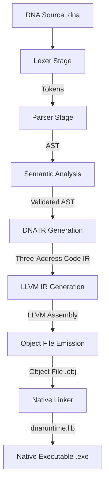

# DNA Programming Language & Ribosome Compiler

Welcome to the official repository of the **DNA Programming Language**! DNA is a native, compiled, object-oriented programming language designed for minimal boilerplate, fast compilation, and high performance without a garbage collector.

---

> [!WARNING]
> **Alpha Release Warning:**  
> This is the first public alpha release of DNA (**v0.2.0 Alpha**). The compiler is under active development. Key features such as class code generation, arrays, and standard libraries are planned or stubbed but **not yet ready** for production use.

---

## Language Overview

DNA combines the ease of use and safety of modern managed languages with the performance characteristics of systems languages:
- **Object-Oriented:** High-level abstractions with classes and structures.
- **Native Compiled:** Compiles directly to host machine-code binaries.
- **No Garbage Collector:** Low-level execution speed without dynamic runtime garbage collection pauses.
- **Hidden Pointers:** Pointers are hidden by default to ensure safe, modern developer ergonomics.

---

## Ribosome Compiler Overview

Ribosome is the reference compiler for the DNA programming language. It lowers DNA code into a custom, human-readable intermediate representation (DNA IR) before lowering it to LLVM IR, compilation to machine-code object files, and linking to native executable binaries.

---

## Project Identity & Status

| Attribute | Value |
| :--- | :--- |
| **Project** | Helix |
| **Language** | DNA |
| **Compiler** | Ribosome |
| **Repository** | `dna-lang` |
| **Current Version** | `v0.2.0 Alpha` |
| **Creator/Developer** | Abhishek Gour |
| **Overall Completion** | 65% |
| **Stability Status** | High (157 tests, 100% pass; 10,000 stress fuzz runs, 0 crashes) |

### Features Implemented
- **Variables:** Stack variable allocation, reads, and writes.
- **Primitives:** `int` (i32), `bool` (i1), and `void` types.
- **Functions (Actions):** Parameters, call resolution, and return values.
- **String Support:** Stack-allocated `String` variables, literals, and prints using native Win64 calling conventions.
- **Control Flow & Loops:** `if`/`else` structures, `while` and `for` loops, with `break` and `continue` support.
- **Operators:** Complete sets of arithmetic, relational, logical, unary, and postfix increment/decrement operators.
- **Duplicate load detection:** Safe load module checking.

### Features Not Yet Implemented
- **Class/Object Codegen:** Classes, fields, and constructors are parsed and checked, but LLVM IR backend lowering is unimplemented.
- **Arrays:** Array declarations, indexing, and runtime arrays.
- **Memory Management:** No heap allocations or automated deallocations (destructors/GC).
- **Standard Library:** Missing file IO, networking, and system APIs.
- **Module System:** Filesystem module resolution is not yet implemented.

---

## Compiler Pipeline Diagram

The Ribosome compiler processes DNA code through the following sequential stages:



---

## Installation & Build Instructions

### Prerequisites
- Windows 10/11 (x64)
- LLVM 18 (binary paths configured)
- MSBuild (Visual Studio Build Tools 2022)
- CMake 3.20+

### Building Ribosome
1. Configure via CMake:
   ```bash
   cmake -B build -S . -DCMAKE_BUILD_TYPE=Release
   ```
2. Build using MSBuild:
   ```bash
   msbuild build/ribosome.sln /p:Configuration=Release
   ```
This generates the compiler executable at `build/Release/ribosome.exe` and the static runtime library at `build/Release/dnaruntime.lib`.

---

## Usage Examples

### Counter Example (`counter.dna`)
```dna
action void main() {
    int i = 0
    while (i < 3) {
        print(i)
        i++
    }
}
```

### Compile & Run
Generate token stream:
```bash
build/Release/ribosome.exe counter.dna --tokens
```

Emit DNA intermediate representation:
```bash
build/Release/ribosome.exe counter.dna --ir
```

Emit LLVM assembly code:
```bash
build/Release/ribosome.exe counter.dna --llvm
```

Compile and link to native executable:
```bash
build/Release/ribosome.exe counter.dna --build
.\counter.exe
```

---

## Testing & Fuzzing Statistics

- **Total Automated Tests:** 157
- **Pass Rate:** 100%
- **Fuzzer Runs (Quick):** 1,000 cases (0 crashes, 0 hangs)
- **Fuzzer Runs (Stress):** 10,000 cases (0 crashes, 0 hangs)
- **Stability Assessment:** High safety. Lexical recovery and parser synchronization shield the codegen stages from crashes on invalid inputs.

---

## Roadmap Summary

- **DNA v0.3:** Support for arrays and memory model layout.
- **DNA v0.4:** OOP backend generation (constructors, fields, methods).
- **DNA v0.5:** Complete module system and compiler namespaces.
- **DNA v0.6:** Standard library development (file IO, math).
- **DNA v1.0:** Optimization passes, target configurations, and production compiler.

---

## License
Licensed under the MIT License - see the `LICENSE` file for details.
Copyright (c) 2026 DNA Language Project.

---

*DNA Programming Language is created and developed by Abhishek Gour.*
