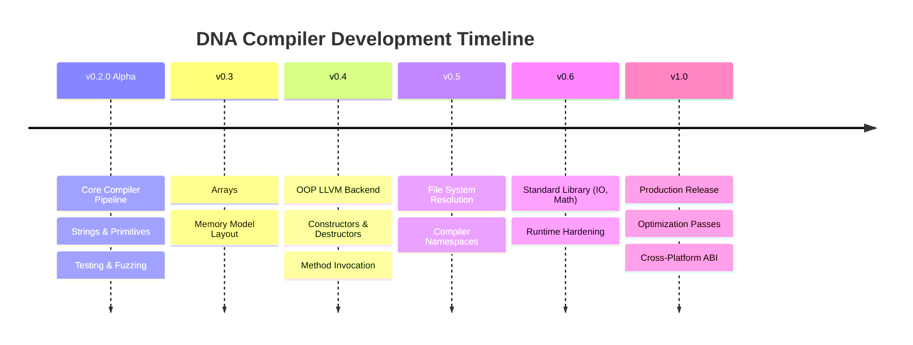

# DNA Programming Language Roadmap

This document outlines the strategic milestones and features planned for the DNA Programming Language and the reference Ribosome compiler. Our journey progresses from the current stable Alpha release towards a production-ready v1.0 specification.

---

## Roadmap Overview

---

## Detailed Milestones

### [DNA v0.3] - Next Milestone
*Focus: Data Collections and Memory Layouts*

- **Arrays**
  - Implement syntax for static and dynamic array declarations: `int[] numbers = [1, 2, 3]`.
  - Add indexing operators (`numbers[0]`) and slice operations.
  - Implement out-of-bounds safety checks in the compiler runtime.
- **Memory Model**
  - Define explicit stack vs heap allocation boundaries.
  - Implement the physical pointer layout mechanics for memory-mapped objects.
  - Establish ownership and copy semantics for compound structures.

### [DNA v0.4]
*Focus: Object-Oriented Programming (OOP) Lowering*

- **OOP Backend**
  - Implement LLVM backend generation for user-defined Class structures.
  - Map dynamic class type layouts (`%struct.ClassName`) in LLVM IR.
  - Set up member variable offsets (`GETFIELD` and `SETFIELD` instruction codegen).
- **Constructors**
  - Generate implicit and explicit constructor actions in LLVM.
  - Support automatic member initialization.
- **Methods**
  - Enable member function binding.
  - Support implicit `this` parameter passing in register allocations.

### [DNA v0.5]
*Focus: Code Organization and Modules*

- **Module System**
  - Implement full filesystem module resolution for `load <module>`.
  - Establish compiler namespaces and import scoping rules.
  - Support multi-file compilation and incremental target builds.

### [DNA v0.6]
*Focus: Standard Library & Platform API Integration*

- **Standard Library**
  - File input/output (I/O) streams.
  - Math standard module (floating point primitives and algebraic functions).
  - Operating system bindings (environment variables, process execution, console interactions).
- **Runtime Hardening**
  - Stabilize dynamic string operations (`dna_string_concat`, `dna_string_copy`, `dna_string_free`).
  - Add native heap memory management and tracing.

### [DNA v1.0]
*Focus: Production Stability and Code Optimization*

- **Production Compiler**
  - Implement LLVM optimization passes (`O1`, `O2`, `O3` configurations).
  - Abstract target platform ABI calling conventions to support cross-compiling (linking on macOS, Linux, and Windows).
  - Add full debugger symbol generation (DWARF / PDB support).
  - Complete "Genome" package manager for external DNA library dependencies.

---

*DNA Programming Language is created and developed by Abhishek Gour.*
