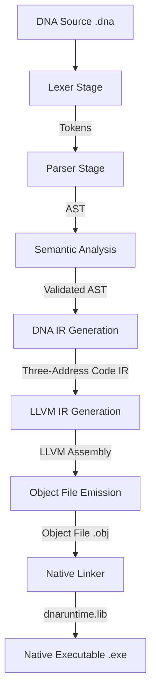

# COMPILER_ARCHITECTURE

This document details the design and architecture of the reference **Ribosome compiler** for the **DNA Programming Language**. It traces the transformation of DNA source code from raw text to native, executable binaries.

---

## 1. Compilation Pipeline Overview

The Ribosome compiler processes DNA code through sequential stages, visualized below:

---

## 2. Module Responsibilities

Each module in the codebase serves a distinct role in the compilation lifecycle:

### A. Lexical Analysis (`lexer/`)
*   **Files:** [Lexer.h](file:///e:/Helix/dna-lang/lexer/Lexer.h), [Lexer.cpp](file:///e:/Helix/dna-lang/lexer/Lexer.cpp), [Token.h](file:///e:/Helix/dna-lang/lexer/Token.h)
*   **Role:** Performs tokenization.
*   **Responsibilities:**
    *   Reads the DNA source text file sequentially.
    *   Identifies token boundaries, stripping out whitespace and comments.
    *   Recognizes keywords (such as `action`, `int`, `bool`, `void`, `String`, `while`, `for`, `if`, `else`, `break`, `continue`, `load`), identifiers, numerical literals, string literals, and symbol boundaries.
    *   Provides source-location mapping (line and column coordinates) for diagnostic reporting.

### B. Parsing (`parser/`)
*   **Files:** [Parser.h](file:///e:/Helix/dna-lang/parser/Parser.h), [Parser.cpp](file:///e:/Helix/dna-lang/parser/Parser.cpp)
*   **Role:** Syntactic structure analysis.
*   **Responsibilities:**
    *   Consumes the token stream generated by the Lexer.
    *   Employs a recursive descent parsing strategy combined with a Pratt parser for binary and unary expressions.
    *   Constructs the Abstract Syntax Tree (AST).
    *   Implements parse error recovery. When syntax errors occur, the parser synchronizes at statement boundaries (e.g., semicolons, block braces) to continue reporting subsequent errors without crashing.

### C. Abstract Syntax Tree (`ast/`)
*   **Files:** [ASTNode.h](file:///e:/Helix/dna-lang/ast/ASTNode.h)
*   **Role:** High-level code structural representation.
*   **Responsibilities:**
    *   Defines core classes representing language nodes: `ProgramNode`, `VarDeclNode`, `FunctionDeclNode`, `ClassDeclNode`, `IfStmtNode`, `WhileStmtNode`, `ReturnStmtNode`, and expression nodes.
    *   Implements the AST Visitor base pattern. This allows analyzer, printer, and generator passes to traverse the structural nodes uniformly.

### D. Semantic Analysis (`semantic/`)
*   **Files:** [SemanticAnalyzer.h](file:///e:/Helix/dna-lang/semantic/SemanticAnalyzer.h), [SemanticAnalyzer.cpp](file:///e:/Helix/dna-lang/semantic/SemanticAnalyzer.cpp)
*   **Role:** Scoping, duplicate symbol checking, and type inference validation.
*   **Responsibilities:**
    *   Walks the AST using visitor methods to populate scoping levels and symbol tables.
    *   Ensures all variables and function calls are declared prior to use and resolves their signatures.
    *   Validates return type matches and parameter arguments in function call expressions.
    *   Enforces type safety constraints (e.g., boolean conditions inside `while` and `if` nodes, valid mathematical operands).
    *   Checks for a valid global entrypoint `action void main()` and prevents duplicate symbol declarations in identical scopes.

### E. DNA Intermediate Representation (`ir/`)
*   **Files:** [IRInstruction.h](file:///e:/Helix/dna-lang/ir/IRInstruction.h), [IRProgram.h](file:///e:/Helix/dna-lang/ir/IRProgram.h), [IRBuilder.h](file:///e:/Helix/dna-lang/ir/IRBuilder.h), [IRGenerator.h](file:///e:/Helix/dna-lang/ir/IRGenerator.h), [IRGenerator.cpp](file:///e:/Helix/dna-lang/ir/IRGenerator.cpp), [IRPrinter.h](file:///e:/Helix/dna-lang/ir/IRPrinter.h), [IRPrinter.cpp](file:///e:/Helix/dna-lang/ir/IRPrinter.cpp)
*   **Role:** Lowers the high-level AST into a flat, compiler-friendly form.
*   **Responsibilities:**
    *   Implements a custom three-address-code (3AC) instruction set.
    *   Employs an SSA strategy utilizing temporary virtual variables (`t0`, `t1`, etc.) for expression evaluation.
    *   Translates control flow statements (`if`/`while`/`for`) into structural jump targets using local branch labels.
    *   Generates global metadata tables describing user-declared structures, functions, and parameters.
    *   Provides debugging and analysis readability by printing IR text streams (via `--ir`).

### F. LLVM Backend Code Generation (`codegen/`)
*   **Files:** [LLVMCodeGen.h](file:///e:/Helix/dna-lang/codegen/LLVMCodeGen.h), [LLVMCodeGen.cpp](file:///e:/Helix/dna-lang/codegen/LLVMCodeGen.cpp), [LLVMContextManager.h](file:///e:/Helix/dna-lang/codegen/LLVMContextManager.h), [LLVMTypeMapper.h](file:///e:/Helix/dna-lang/codegen/LLVMTypeMapper.h), [LLVMValueMapper.h](file:///e:/Helix/dna-lang/codegen/LLVMValueMapper.h)
*   **Role:** Translates DNA IR into LLVM Assembly and generates machine code.
*   **Responsibilities:**
    *   Maps DNA types (such as primitive `int` and `bool`) into LLVM types (`i32`, `i1`).
    *   Maintains LLVM context objects, modules, and construction builders via the context manager.
    *   Lower instructions from DNA IR 3AC to LLVM instructions, mapping virtual registers to SSA values.
    *   Emits target machine code by configuring host configurations (data layouts, target triples) and compiles the module down to a native Windows object file (`.obj`).

### G. Runtime Support (`runtime/`)
*   **Files:** [DNAString.h](file:///e:/Helix/dna-lang/runtime/DNAString.h), [DNAString.cpp](file:///e:/Helix/dna-lang/runtime/DNAString.cpp)
*   **Role:** Native code execution helper layer.
*   **Responsibilities:**
    *   Defines the runtime layout of compound structures (such as `DNAString` with `data`, `length`, and `capacity` metadata).
    *   Provides C-linkage APIs (like `dna_print_string` and `dna_string_literal`) invoked by the generated LLVM assembly code.
    *   Manages string literal construction and console printing routines.

### H. Linking Phase (`main.cpp`)
*   **Role:** Combines target object code with runtime libraries.
*   **Responsibilities:**
    *   Discovers the system Visual Studio Build Tools path dynamically.
    *   Writes a temporary batch file (`link.bat`) executing Visual Studio's `link.exe`.
    *   Links the compiler-emitted `.obj` file with `dnaruntime.lib` and Windows CRT support libraries to emit a native, stand-alone Windows executable (`.exe`).

---

## 3. ABI and Calling Conventions (Windows x64)

Under the target Windows x64 ABI:
- **Struct passing constraints:** Structs larger than 8 bytes (including the 16-byte `DNAString` struct layout) must be passed and returned by reference.
- **Return mappings:** Any action returning a `DNAString` is compiled into a C-function returning `void` where the first argument is a pointer (`sret`) pointing to an allocated temporary variable.
- **Argument mappings:** Invocations of actions receiving a `DNAString` (such as `print(String)`) compile into passing a `ptr` targeting a temporary copy allocated on the stack.

---

*DNA Programming Language is created and developed by Abhishek Gour.*
